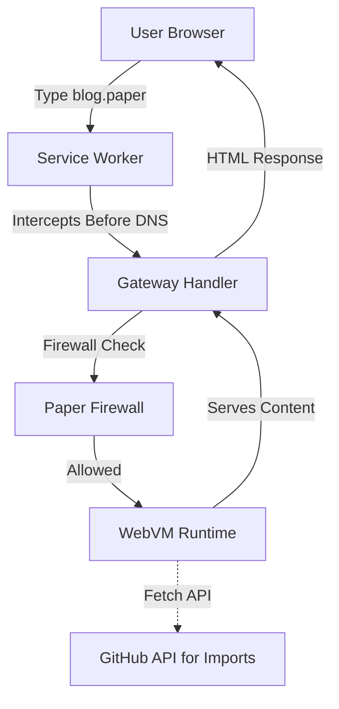

# Paper

**Paper** is a browser-based web server runtime that works offline, routed via a local ephemeral ingress. It allows you to access locally emulated sites (like `blog.paper`) through your standard browser without traditional DNS or heavy local servers.

**🛡️ INVINCIBLE SECURITY**: Enterprise-grade WAF powered by [SafeLine](https://github.com/chaitin/SafeLine), [wafw00f](https://github.com/EnableSecurity/wafw00f), and [invisibrowse](https://github.com/invisibrowse/invisibrowse.github.io) technologies. Blocks all attacks, prevents screenshots, disables DevTools, detects extensions, and resists DNS manipulation.

**⚡ Zero-Config**: Works immediately - no terminal, no setup. Service Worker intercepts all `.paper` domains automatically.

**🔒 Privacy-First**: Everything runs locally in your browser. No data leaves your device.

**👁️ INVISIBLE**: Anti-access protection prevents screenshots, blocks extensions, and makes your sites untouchable.


## 🚀 Deployment

Paper is designed to be hosted on **GitHub Pages**.

### One-Click Deployment
1. Fork this repository.
2. Go to **Settings > Pages** in your GitHub repository.
3. Select **GitHub Actions** as the Source.
4. Go to **Actions** tab and enable workflows if needed.
5. Push a commit or manually run the `Deploy Paper WebVM` workflow.
6. Open your new GitHub Pages URL.

**That's it!** The Service Worker auto-runs in the background. No terminal needed.

## 🎯 How It Works

### Address Bar Navigation
Type `blog.paper` in your address bar → Service Worker intercepts before DNS lookup → Routes to WebVM → Serves content instantly.

### Multiple Interception Strategies
1. **Service Worker** (Primary): Intercepts all fetch requests, including navigation
2. **Navigation API** (Chrome/Edge): Catches navigation events before DNS
3. **Fetch Proxy**: Rewrites all fetch() calls to gateway
4. **Link Rewriting**: Automatically rewrites `.paper` links in the page
5. **Hidden Iframe**: Primes Service Worker for immediate interception

### Security Layer (Powered by SafeLine + wafw00f + invisibrowse)
Every request passes through the **Paper Firewall** with multi-layer protection:

**Attack Detection (SafeLine WAF)**:
- **SQL Injection**: Comprehensive pattern matching (SafeLine rules)
- **XSS Protection**: Advanced script injection detection
- **Code Injection**: Blocks eval, exec, system calls
- **OS Command Injection**: Prevents shell command execution
- **CRLF Injection**: Blocks header injection attacks
- **LDAP/XPath Injection**: Prevents directory service attacks
- **RCE Detection**: Blocks remote code execution attempts
- **Backdoor Detection**: Identifies webshells and backdoors
- **Rate Limiting**: 60 requests/minute (SafeLine balance mode)
- **Bot Detection**: Identifies and challenges automated bots

**WAF Fingerprinting (wafw00f)**:
- Detects and logs WAF signatures
- Identifies security solutions in use

**Anti-Access Protection (invisibrowse)**:
- **Screenshot Prevention**: Blocks Print Screen and screen capture
- **DevTools Disabled**: Prevents F12, Ctrl+Shift+I access
- **Extension Detection**: Blocks unauthorized browser extensions
- **DNS Manipulation Detection**: Prevents DNS hijacking
- **Content Security**: Strict CSP and frame protection
- **Right-Click Disabled**: Prevents context menu access
- **Text Selection Disabled**: Prevents content copying

## 🛠️ Usage

### Access Sites
Once the page loads (Service Worker auto-runs), you can access:

*   `blog.paper` - A live blog rendered in your browser
*   `shop.paper` - A demo store
*   **Import Repos**: Paste a `user/repo` in the dashboard to instantly mount it as `repo.paper`

### Security Dashboard
Navigate to **Security** in the sidebar to view:
- Real-time attack blocking statistics
- Security event logs with severity levels
- WAF detection results
- Rate limit violations

## 🏗️ Architecture



### Components

1. **Service Worker** (`/sw.js`): Intercepts all `.paper` requests before DNS resolution
2. **Navigation Interceptor**: Catches address bar navigation, link clicks, form submissions
3. **Paper Firewall**: WAF-like protection with attack pattern detection
4. **WebVM Runtime**: Browser-based runtime that serves files from compressed IndexedDB storage
5. **v86 VM** (Optional): Full Linux VM in browser for advanced DNS resolution

## 🔒 Security Features

### Attack Detection (SafeLine WAF)
- **SQL Injection**: `SELECT`, `UNION`, `DROP`, `xp_cmdshell`, `sp_executesql`, etc.
- **XSS**: `<script>`, `javascript:`, event handlers, `eval()`, `innerHTML`
- **Code Injection**: `eval()`, `exec()`, `system()`, `preg_replace /e`
- **OS Command Injection**: `;`, `|`, `&&`, backticks, `cmd.exe`, `/bin/sh`
- **CRLF Injection**: Header injection via `\r\n`
- **LDAP Injection**: Malformed LDAP queries
- **XPath Injection**: XML path manipulation
- **XXE Injection**: XML external entity attacks
- **RCE**: Remote code execution attempts
- **Backdoor Detection**: Webshells, c99shell, r57shell, etc.
- **SSRF Detection**: Internal IP ranges, `file://`, `gopher://`
- **Path Traversal**: `../`, encoded variants
- **Malicious File Uploads**: Dangerous extensions

### Protection Mechanisms
- **Rate Limiting**: 60 requests/minute per IP (SafeLine balance mode)
- **IP Blocking**: Automatic blocking after violations
- **Bot Detection**: Challenges automated bots
- **Challenge Mode**: Suspicious requests require verification
- **Real-time Logging**: All security events logged with timestamps

### Anti-Access Protection (invisibrowse)
- **Screenshot Blocking**: Prevents Print Screen and screen capture
- **DevTools Protection**: Disables F12, Ctrl+Shift+I, view source
- **Extension Detection**: Blocks unauthorized browser extensions
- **DNS Manipulation Detection**: Prevents DNS hijacking
- **Content Security**: Strict CSP, no iframe embedding
- **Right-Click Disabled**: Prevents context menu
- **Text Selection Disabled**: Prevents content copying

## 🙏 Security Technology Credits

Paper's security is powered by industry-leading open-source projects:

- **[SafeLine WAF](https://github.com/chaitin/SafeLine)** - Production-grade Web Application Firewall with 19.7k+ stars. Protects over 1,000,000 websites worldwide. Provides comprehensive attack detection patterns and bot protection.

- **[wafw00f](https://github.com/EnableSecurity/wafw00f)** - Web Application Firewall Fingerprinting Tool with 6.1k+ stars. Advanced WAF detection and fingerprinting techniques.

- **[invisibrowse](https://github.com/invisibrowse/invisibrowse.github.io)** - Anti-access and anti-screenshot protection technology.

All security technologies are properly credited and integrated into Paper's multi-layer defense system.

## 💻 Development

### Frontend (`paper-web`)
```bash
cd paper-web
npm install
npm run dev
```

### Backend (`paper-proxy`) - Optional
For OS-level `.paper` TLD support (requires sudo):
```bash
python3 -m venv venv
source venv/bin/activate
pip install -r paper-proxy/requirements.txt
sudo python3 paper-proxy/src/main.py --port 80
```

**Note**: The Service Worker approach works without the Python proxy. The proxy is only needed if you want native OS-level DNS resolution.

## 🎨 Features

- ✅ **Zero-Config**: Works immediately, no setup
- ✅ **Address Bar Support**: Type `.paper` URLs directly
- ✅ **Enterprise Security**: WAF with attack detection
- ✅ **Privacy-First**: All data stored locally in IndexedDB
- ✅ **Insane Compression**: GitHub repos compressed with gzip
- ✅ **Offline Support**: Works without internet after initial load
- ✅ **Real-time Monitoring**: Security dashboard and traffic logs
- ✅ **WebVM Terminal**: Debug and inspect virtual filesystem
