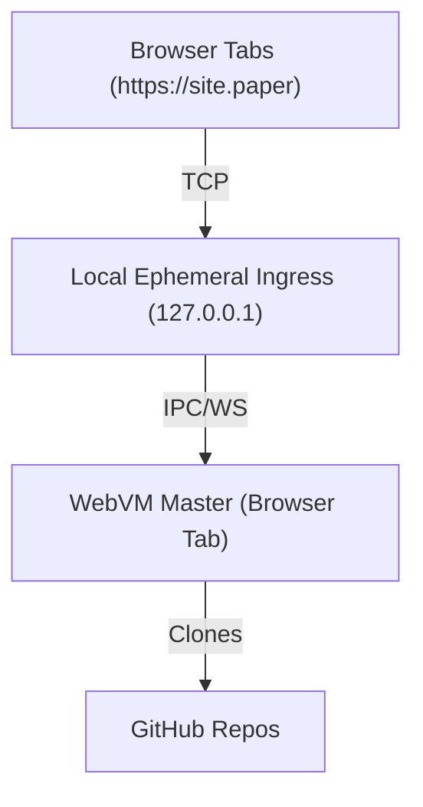

# Paper

Paper is a minimalist, local-first web development environment that runs entirely in your browser tabs, routed via a local ephemeral ingress.

## Architecture

## Components

### 1. WebVM Master (`paper-web`)
- **Hosted on:** GitHub Actions (GitHub Pages)
- **Tech Stack:** TypeScript, React, Vite, WebContainers (conceptually)
- **Role:** 
    - Serves the monochrome, minimalist UI.
    - Manages the lifecycle of the local ingress.
    - Handles "server-side" logic for the `.paper` sites using in-browser emulation.

### 2. Local Ingress (`paper-proxy`)
- **Tech Stack:** Python (Method B)
- **Role:**
    - Listens on `127.0.0.1`.
    - Routes `*.paper` requests to the WebVM via WebSocket.
    - Minimal footprint, no installation required (just run the script).

## Usage

1. Open `https://paper.dev` (or the GH Pages URL).
2. The WebVM starts and prompts to run the local proxy.
3. User runs: `python paper-proxy/main.py`
4. User accesses `my-project.paper` in a new tab.
5. Request hits `127.0.0.1` -> Proxy -> WebSocket -> WebVM -> Rendered Response.

## Visual Design
- Monochrome (Black & White).
- High contrast.
- Minimalist typography (Inter/Monospace).

